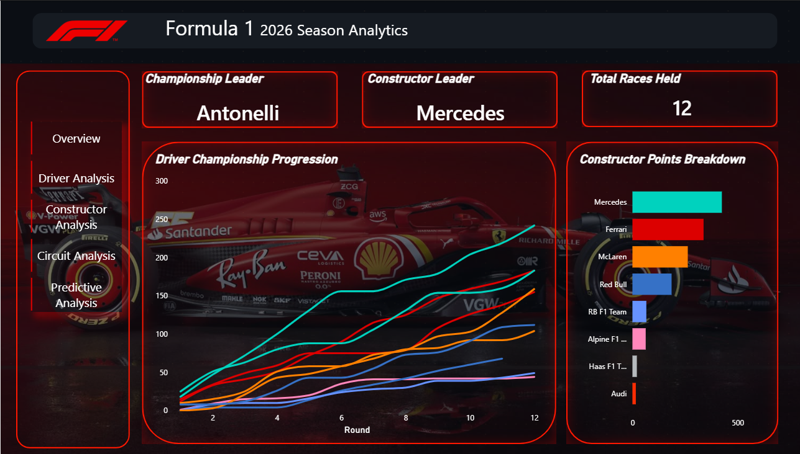

# 🏎️ F1 Analytics Dashboard

A live Formula 1 analytics dashboard for the **2026 season**, combining automated data engineering, PostgreSQL, machine learning, and Power BI into a single end-to-end analytics project.

The project automatically collects race-weekend data, processes and stores it in Supabase, generates race-position predictions using a machine learning model, and presents the results through a **5-page Power BI dashboard**.

---

## 📊 Dashboard Preview

### Overview

<!-- Add screenshot: screenshots/overview.png -->



### Driver Analysis

<!-- Add screenshot: screenshots/driver-analysis.png -->


### Constructor Analysis

<!-- Add screenshot: screenshots/constructor-analysis.png -->


### Circuit Analysis

<!-- Add screenshot: screenshots/circuit-analysis.png -->


### Predictive Analysis

<!-- Add screenshot: screenshots/predictive-analysis.png -->


---

## 🔎 Overview

The dashboard is designed to answer three main questions:

* **What is happening in the 2026 F1 season?**
* **How are drivers, constructors, and circuits performing?**
* **What does the model predict for the next race?**

It combines historical race data, qualifying performance, lap-level timing, tyre strategy, pit stops, weather, championship standings, and machine learning predictions.

### Key Features

* Live 2026 driver and constructor standings
* Race and qualifying performance analysis
* Lap-by-lap pace analysis
* Sector-time comparisons
* Tyre strategy and stint analysis
* Pit-stop analysis
* Circuit and weather analysis
* Driver and constructor championship progression
* Qualifying pace vs. race finish analysis
* Machine learning predictions for the upcoming race
* Automated weekly data pipeline using GitHub Actions

---

## 📑 Dashboard Pages

The Power BI report contains five analytical pages.

| Page                     | Key Analysis                                                                                                  |
| ------------------------ | ------------------------------------------------------------------------------------------------------------- |
| **Overview**             | Championship leader, constructor leader, races completed, driver championship progression, constructor points |
| **Driver Analysis**      | Driver standings, points, wins, lap pace, sector performance, qualifying vs. race position                    |
| **Constructor Analysis** | Team standings, points, wins, qualifying vs. race finish, teammate comparison, championship progression       |
| **Circuit Analysis**     | Circuit information, track characteristics, weather, tyre strategy, pit stops, and track layout               |
| **Predictive Analysis**  | Predicted winner/P2/P3, predicted grid, model predictions, and feature importance                             |

---

## 🏗️ Architecture

```text
                         F1 Data Sources
                 ┌──────────┼──────────┐
                 ▼          ▼          ▼
              FastF1     OpenF1    Ergast API
                 │          │          │
                 └──────────┼──────────┘
                            ▼
                    Python ETL Pipeline
                   python/f1_pipeline.py
                            │
                            ▼
                       Clean CSVs
                          data/
                            │
                 ┌──────────┴──────────┐
                 ▼                     ▼
          Supabase / Postgres      ML Pipeline
                 │               ml/f1_predictions.py
                 │                     │
                 │                     ▼
                 │               Predictions +
                 │              Feature Importance
                 │
                 └──────────┬──────────┘
                            ▼
                       Power BI Report
                         5 Pages
```

The entire data pipeline can be executed automatically through **GitHub Actions** or run locally.

---

## ⚙️ Data Pipeline

The main ETL pipeline, `python/f1_pipeline.py`, together with `python/openf1_enrichment.py`, processes completed race weekends.

### 1. Master Data

The pipeline collects:

* Season schedule
* Driver information
* Constructor information
* Driver standings
* Constructor standings

### 2. Race-Weekend Data

For each completed round, the pipeline extracts:

* Qualifying results
* Race results
* Sprint results and points
* Lap-level timing
* Tyre stints
* Pit stops
* Fastest laps
* Weather data
* Circuit information

Data is collected from multiple F1 data sources depending on the dataset and availability.

Sprint points are sourced from Ergast where available, with FastF1 used as a fallback.

OpenF1 is used to enrich the dataset with additional race-session information.

### 3. Data Export

Processed datasets are written as clean CSV files inside `data/`.

These datasets are then loaded into Supabase PostgreSQL for use by the dashboard and machine learning pipeline.

---

## 🤖 Machine Learning

The predictive analysis uses a **Random Forest Regressor** to estimate each driver's finishing position in the upcoming race.

The model is trained using historical race data and driver/team performance going into each round.

### Features Include

* Previous race finish
* Average historical finish
* Recent form
* DNF rate
* Team average finish
* Points accumulated before the race
* Qualifying/grid-related performance

The model uses **walk-forward validation** across historical rounds to reduce data leakage and better simulate how predictions would work during a live season.

A **Gradient Boosting Regressor** is also used as a comparison model during validation.

### Model Outputs

The ML pipeline generates:

```text
ml/outputs/
├── f1_prediction_results.csv
└── f1_feature_importance.csv
```

The prediction output is then used by the **Predictive Analysis** page in Power BI.

> The model is intended as an analytical prediction tool rather than a betting or race-outcome system. It does not account for future incidents, strategy decisions, weather changes, safety cars, or mechanical failures.

---

## 🗄️ Database

The project uses **Supabase PostgreSQL** as the central database.

`SQL/load_to_supabase.py` loads the processed CSV datasets into corresponding PostgreSQL tables.

This creates a central data layer between the Python pipeline and Power BI:

```text
Python Pipeline
      │
      ▼
    CSVs
      │
      ▼
Supabase PostgreSQL
      │
      ▼
   Power BI
```

SQL was also used to create analytical queries for exploring and validating the F1 datasets.

---

## 🔄 Automation

The complete pipeline is automated using **GitHub Actions**.

The scheduled workflow runs after each race weekend and performs the following:

```text
1. Checkout repository
        ↓
2. Install Python dependencies
        ↓
3. Run F1 ETL pipeline
        ↓
4. Run OpenF1 enrichment
        ↓
5. Update CSV datasets
        ↓
6. Commit updated data
        ↓
7. Load datasets into Supabase
        ↓
8. Run ML prediction pipeline
        ↓
9. Commit updated ML outputs
```

The workflow runs on a weekly schedule and can also be triggered manually using `workflow_dispatch`.

---

## 🛠️ Tech Stack

| Area             | Technology                     |
| ---------------- | ------------------------------ |
| Data extraction  | FastF1, OpenF1 API, Ergast API |
| Programming      | Python                         |
| Data processing  | pandas, NumPy                  |
| Database         | PostgreSQL / Supabase          |
| Database access  | SQLAlchemy, psycopg2           |
| Machine Learning | scikit-learn                   |
| Automation       | GitHub Actions                 |
| Visualization    | Power BI                       |
| Version Control  | Git / GitHub                   |

---

## 📁 Repository Structure

```text
F1-Analytics-Dashboard/
│
├── data/
│   ├── race_results.csv
│   ├── qualifying.csv
│   ├── standings.csv
│   └── ...
│
├── python/
│   ├── f1_pipeline.py
│   └── openf1_enrichment.py
│
├── SQL/
│   └── load_to_supabase.py
│
├── ml/
│   ├── f1_predictions.py
│   └── outputs/
│       ├── f1_prediction_results.csv
│       └── f1_feature_importance.csv
│
├── screenshots/
│   ├── overview.png
│   ├── driver-analysis.png
│   ├── constructor-analysis.png
│   ├── circuit-analysis.png
│   └── predictive-analysis.png
│
├── .github/
│   └── workflows/
│       └── update_f1.yml
│
├── requirements.txt
└── README.md
```

---

## 💻 Local Setup

### 1. Clone the repository

```bash
git clone https://github.com/Rochit1/F1-Analytics-Dashboard.git
cd F1-Analytics-Dashboard
```

### 2. Install dependencies

```bash
pip install -r requirements.txt
```

### 3. Configure Supabase

Set your Supabase PostgreSQL connection string as an environment variable:

```bash
export DATABASE_URL="postgresql+psycopg2://postgres:<password>@<host>:5432/postgres"
```

On Windows PowerShell:

```powershell
$env:DATABASE_URL="postgresql+psycopg2://postgres:<password>@<host>:5432/postgres"
```

### 4. Run the pipeline

```bash
python python/f1_pipeline.py
python python/openf1_enrichment.py
python SQL/load_to_supabase.py
python ml/f1_predictions.py
```

---

## ⚠️ Known Limitations

* Some FastF1 session data may not be immediately available after a race or qualifying session. The pipeline handles missing data and can retrieve it during a later run.
* Predictions depend on the availability of upcoming-round data.
* The model predicts finishing position from historical performance and qualifying-related features rather than simulating the race itself.
* Race incidents, safety cars, strategy decisions, mechanical failures, and changing weather conditions are not explicitly modeled.
* Machine learning predictions should therefore be interpreted as **analytical estimates**, not guaranteed race outcomes.

---

## 🚀 Future Improvements

Potential future additions include:

* Red-flag and safety-car-aware lap-time filtering
* Circuit-specific historical performance features
* More advanced feature engineering
* Random Forest vs. Gradient Boosting model comparison
* Model performance tracking across the season
* Additional race-strategy analytics

---

## 🎯 Project Goal

This project was built as an end-to-end demonstration of how **data engineering, SQL, machine learning, automation, and business intelligence** can be combined into a single real-world analytics application.

Rather than relying on a static dataset, the project is designed around a continuously evolving Formula 1 season, requiring the pipeline to handle new race data, changing standings, incomplete sessions, and future-race predictions as the season progresses.
